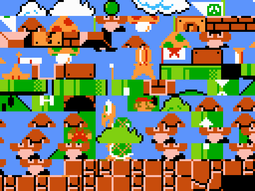
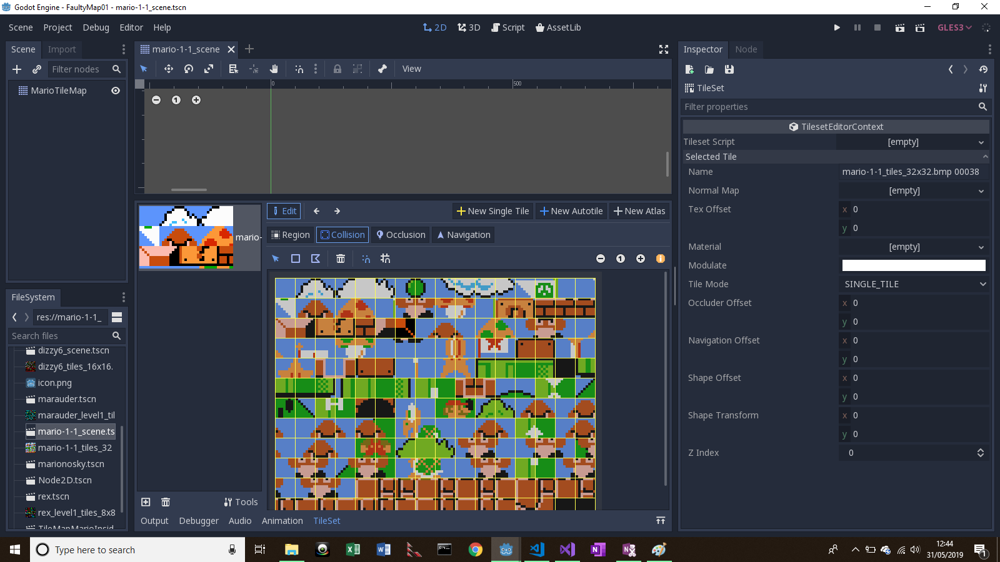
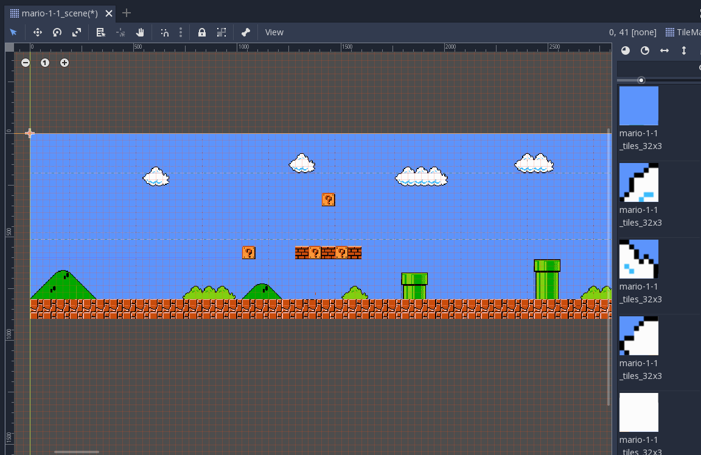
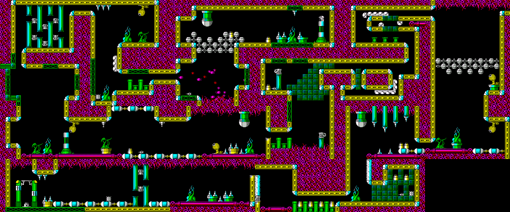
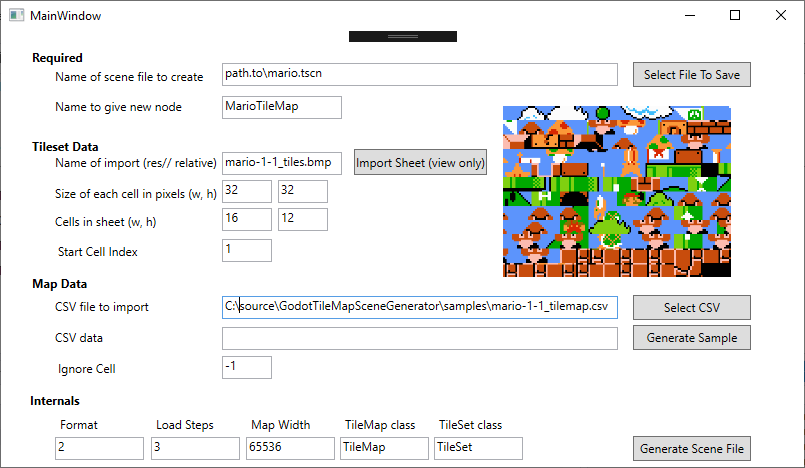
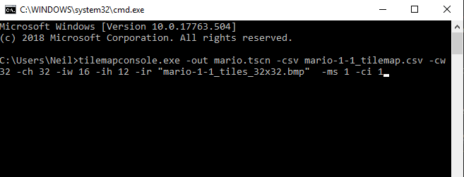
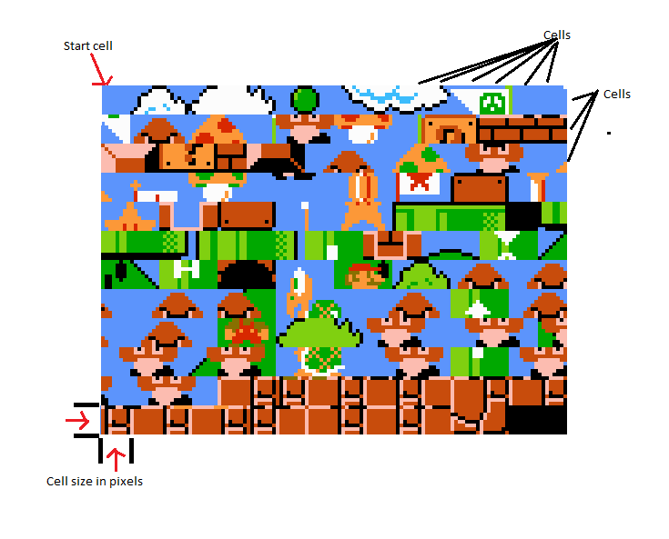

# GodotTileMapSceneGenerator

## Introduction
This tool does two things
1. Generate a Godot tilemap scene file (the tileset) from a given tilesheet graphic
2. Creates tilemap data for a map supplied by a given CSV file or string data

## Quick Overview
Assume you have the following graphic from world 1-1 of Mario

And you want to create a tilemap in Godot from them. The problem is you have to create each cell, one at a time. With the tilemap generator you can run a command line or a GUI application (or your own tool using the class library) and have a scene file generated complete with every cell generated in a few seconds. Ready to create your game:

However, what if you wanted to automatically create a map too? The tilemap generator will let you supply a CSV file where each entry represents a tile, e.g. 0 is the first tile graphic imported into Godot

<blockquote>
 1, 2, 3, 7,56
 4, 5, 2, 1, 2
35,23,35,67,12
</blockquote>

Doing so will then not only create the tileset as above, but also the map:

You may be wondering where you get the tilesheet or the CSV from. There are many sites with opensource tilesheets or tilesheets from games. Alternatively, all the sample tilesheets and maps were generated by other tools I've written.

### Spritesheet/CSV generation
Application: http://retrospec.sgn.net/game/tiler

This software runs under Windows and from a given bitmap file it will extract all the tiles and generate a CSV file. It can be customised to specify the size of each tile, whether to resize the tiles (handy to convert small 8x8 tiles to 32x32), convert to bitonal (to remove duplicate tiles that are different only by colour, and to let you recolour the tiles) and optionally to generate individual tiles rather than a single sprite sheet.

Example: Cybernoid map and generated tilesheet using Tiler

Further details and use of the toole can be found in the [Samples section](samples/README.md)

The next question is how do you generate a map of a game to create the CSV and spritesheet. The simplest way is to find one already done. If you like retro, there are plenty to be found for the ZX Spectrum here: https://maps.speccy.cz/

These Spectrum maps were created typically by simply taking screenshots and pasting together. However, I have created some of the maps (Rex in the samples) using another Windows tools:
Application: http://retrospec.sgn.net/game/specmapper

The software automates map generation by creating a grid of squares each the size of the screen. You simply take a screenshot, go to the application and it will be pasted in. It caters for removing margins, etc. The only problem is I don't have the source code and on Windows 10 you may get an error registering the file 'COMCTL32.OCX' :(

## Tilemap Generator Software (at this repo)
The tool is written in .Net Core 3 (preview) as a command line program and a GUI. Meaning the command line tool will run under Windows, Mac, Linux and the GUI on Windows (unless Windows WPF has been ported). 

Alternatively, because the command line/GUI are simply entry points to a common class library, you can create your own. The class library is a single file class library project and is accessed simply by using a 'Builder' pattern, as detailed in the source code section.

Screenshots below show the application in use.

Assume you just have a tilesheet as shown below and wish to create a tilemap with all the tiles created, but no map. Either run the console application or the GUI and specify the values as follows and refer to the image below for description:

| GUI Parameter           | Console Flag  | Default value and details |
| -------------| -----| ----------------- |
| Name of scene file to create | -out filename | Must be specified |
| Name to give new node | -nn name | Name given to node. Can be changed inside Godot |
| Name of import | -ir filename | Tilesheet image. Image is not used but must be available inside Godot. Exclude drive prefix |
| Size of each cell in pixels | -cw <int> | Defaults to 32. Width of each element |
| Size of each cell in pixels | -ch <int> | Defaults to 32. Height of each element |
| Cells in the tilesheet | -cw <int> | Total number of individual cells in width of image. Do not leave at 0! |
| Cells in the tilesheet | -ch <int> | Total number of individual cells in height of image. Do not leave at 0! |

When you generate the scene the image does not have to be present, it simply works from the numbers and names you give it and presumes you are supplying the correct information. i.e. internally it simply creates cell_width * cell_height entries and each entry references the name of the import tilesheet provided. 

If you have a CSV file with the map data (as supplied with the samples), then the following can be specified:

| GUI Parameter           | Console Flag  | Default value and details |
| -------------| -----| ----------------- |
| Start cell index | -ci <int> | Defaults to 0. What number matches the first cell in the CSV. All samples are 1 |
| CSV file to import | -csv filename | Name of CSV file holding map data |
| CSV data | -csd <string> | CSV as a string. More for testing/debugging than actual generation, but may be useful |
| *Ignore cell | -ms <int> | Which cell index (typically first if used) to ignore. Defaults to -1 (do not ignore any) |

*The CSV specifies every cell in a rectangular grid (2D array). If a cell is blank and has no tile then typically the first cell in the tilesheet is the blank cell and to conserve space or to ensure it is drawn transparently (i.e. you are supplying your own background) specify which index is to be skipped. Normally this will be the first cell. It is the value read from the CSV so the first cell is the 'start cell index' and not necessarily 0. Note that cells are numbered sequentially so if the last cell of row 1 is index 10, then the first cell row 2 is index 11, i.e. treat the tilesheet grid as a single long row.

There are other values that can be specified that are more internal and are to be updated if Godot changes or you have redefined some classes.

-sf (format): specifies the format shown in the header.
-ls (load_steps): specifies the current step number shown in the header (not believed to be used - or rather relevant).
-gw (map width): number of cells in a row inside Godot. In the Godot tilemap format each x/y cell is represented by a single value with each row being an increment of this value (65536)
-nt (Tilemap class): Name of class for the tilemap
-st (Tileset class): Name of class for the tileset

Refer to the samples section for details of the sample maps and tilesheets provided. Also note that in the samples folder are all the samples with scene files generated. So to test, simply copy the .tscn file and the tilesheet graphic (e.g. mario-1-1_tiles_32x32.bmp - all tilesheets have the word 'tiles' in the name) to the project folder and double click.

Note, if the tilemap crashes it is due to how Godot pre-loads every tileset image and creates multiple graphics (pretty wasteful, probably best to have lazily loaded them), go into your project settings find the 'queue size' value (default: 1024) and change to a large number (e.g. 102400).
