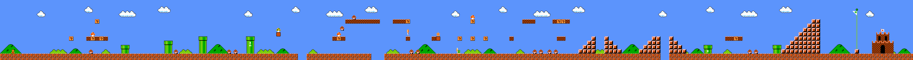
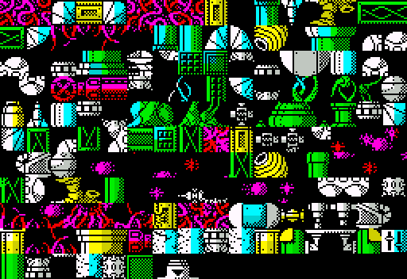
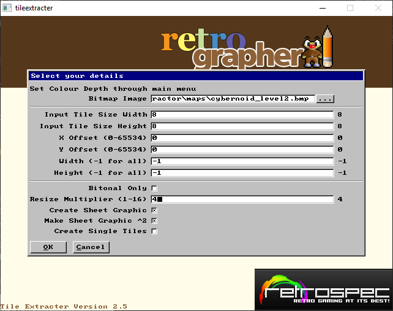
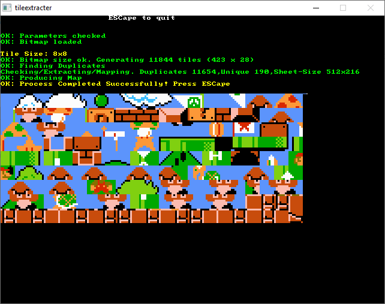

## Quick Start
1. Download the GAME.tscn file you want to try
2. Download the GAME_tiles_WxH.bmp file
3. Put both in your sample project folder together and double click the scene

If you wish to move the bmp file to another folder (e.g. ./assets) then edit the .tscn file and simply modify the entry near the top, e.g.
[ext_resource path="res://assets/tilesheet.png" type="Texture" id=1]

If you wish to import the scene file but do not want the actual tilemap created (i.e. you just want the tiles), edit the .tscn file and at the very bottom and delete the last line, which is probably very large and wraps on multiple lines, e.g.

tile_data = PoolIntArray( 1, 0, 0, 2, 1, 0, 0, 2, 65536, 1, 3, 65536, 2, 4, 65536 )

#### Important
If you are loading in Windows it seems to crash when you use most of the samples because it is doing something seemingly very inefficient when loading the tilesets. You will see this by an infinite looping error in Godot console window. To fix this, go to the project settings, find the 'maximum queue size' property and change from 1024 to something very large, e.g. 102400 (1Gb, presuming you have enough memory).

## Samples

There are 5 files for each game
- A bitmap map of the game or level that represents what the level looks like
- A bitmap tilesheet that represents each cell within the map, i.e. individual tiles from the map
- A CSV of the level
- A cmd file to run the tool from the command line

### Bitmap Map
The bitmap map is what we want the tilemap to end up looking like in Godot. They were taken from various open source locations. This file is not used by the software, it is just for reference.

- Rex (area 1 of 2): A zx spectrum game. 8 colour graphics 240x68, original is 8x8 pixel tiles
- Cybernoid 2: A zx spectrum game. 8 colour graphics 256x128, original is 8x8 pixel tiles
- Dan Dare 1: A zx spectrum game. 8 colour graphics 240x144, original is 8x8 pixel tiles
- Dizzy 6: A zx spectrum game. 8 colour graphics 198x188, original is 8x8 pixel tiles
- Marauder (first level): A zx spectrum game. 8 colour graphics 224xY, original is 8x8 pixel tiles
- Mario World 1 Level 1: Original Mario world map. 8 colour graphics width x 224, original is 8x8 pixel tiles 

The Rex map was created my me using a tool I created for Windows many years ago in Visual Basic. You can find the application below. Basically creating the screenshot maps is a simple process of run the game, take a screenshot, switch to the application and it is pasted at the current location. Move to the next location in the mapping application, then repeat the process. You end up with a map similar to the GAME_Map.bmp files in this folder.

Note, if you try the tool, it may fail due to 'comctl32.ocx'. I don't have the source anymore to recompile.

Application: http://retrospec.sgn.net/game/specmapper
Sample map:
[]

### Bitmap Tilesheet
This is a grid based graphic containing every tile in the tilesheet. All samples are called GAME_tilemap.bmp

BMP is not a required format, any format supported by Godot is valid. Note, this file is not used directly by the library, it is simply there to put a name in the generated scene file and a reminder for you to put the required file with the scene file when importing.

Each tiltesheet was generated by a tool I have written and still works in all versions of Windows. You supply the tool with a bitmap map (i.e. the map we mentioned in the previous section), the size of each tile and let it run. The tool has a few options to help:
- specify a multiplier on output, e.g. Mario is 16x16 pixels per tile so for this sample a multiplier of 2 was used to create 32x32 tiles
- specify black and white. This will remove all colour and helps when there are many duplicate tiles that only differ by colour
- Power of 2. It's sometimes useful (probably not for Godot) to ensure the sprite sheet width is a power of 2 to avoid any import issues, e.g. 64, 128, 256, etc.

Application: http://retrospec.sgn.net/game/tiler
Sample tilesheet of Cybernoid and the tile tool

[]

[]

[]

As you can see by the extraction tool, it is quite efficient, but there are Gumbas in the sheet! You're best off removing all items you do not want in the map before using.

### CSV Map
This is an optional part of the Godot Tilemap, and if supplied will produce the actual map for display and use in the current scene. If not provided, on loading the scene you simply use the generated tilesheet to draw your own.

There is one CSV file in the format GAME_tilemap.csv for each game.

The CSV expected by the tool is comma separated with a newline at the end of each row.

Each item is an index to the tile to use from the supplied bitmap tilesheet as imported into Godot from the scene and as described above. Each index is an integer representing the tile from the graphic. The very first tile is index 0, then 1, etc and increases and wraps around each line in the tilesheet.

The tool expects a number for every single cell, i.e. all 2D locations are set in a grid/rectangular list, e.g.
1,6,3,4,8
1,2,3,6,9
1,2,2,7,1

So when the scene is generated the tileset item 0 is then mapped to the first cell in the tilesheet.

For cells that contain no item you still need an entry in the CSV, however you specify in the tool which index represents this empty cell and will be skipped.

Also, while Godot is zero indexed (tile 0 is first tile), the CSV may well be 1 based, so to avoid the wrong tiles being allocated you can specify which is the first. In the samples provided they are all 1 based.

#### Notes
Mario has a blue sky, which is the first tile in the tilesheet and represented by 1 in the CSV. If you set 1 as the empty cell then these will be skipped and so you will end up with a tilemap in Godot with transparent sky. 

### Generating Scenes From Samples
There is a sample windows command file (but you can easily modify it for any environment) that you can use to run, or to simply get the correct parameters when trying out for every file. They are also below. Alternatively, use the Windows GUI tool provided instead. To give each generated scene a custom node name (other than the default 'TileMap' add the -nn as an option, e.g. -nn MarioTileMap)

In the case of all the games except Marauder, they all have the first tile as the empty tile. In the case of Mario, two are supplied, one with sky and one without sky.

Also note, in Marauder the red, yellow, green tiles are actually parallax scrolled in the actual game.

tilemapconsole.exe -out mario.tscn -csv mario-1-1_tilemap.csv -cw 32 -ch 32 -iw 16 -ih 12 -ir "mario-1-1_tiles_32x32.bmp"  -ms 1 -ci 1
tilemapconsole.exe -out marioNoSky.tscn -csv mario-1-1_tilemap.csv -cw 32 -ch 32 -iw 16 -ih 12 -ir "mario-1-1_tiles_32x32.bmp"  -ci 1

tilemapconsole.exe -out rex.tscn -csv rex_level1_tilemap.csv -cw 8 -ch 8 -iw 32 -ih 10 -ir "rex_level1_tiles_8x8.bmp"  -ms 1 -ci 1

tilemapconsole.exe -out cybernoid.tscn -csv cybernoid_level2_tilemap.csv -cw 32 -ch 32 -iw 16 -ih 11 -ir "cybernoid_level2_tiles_32x32.bmp"  -ms 1 -ci 1

tilemapconsole.exe -out dandare.tscn -csv dandare1_tilemap.csv -cw 32 -ch 32 -iw 32 -ih 14 -ir "dandare1_tiles_32x32.bmp"  -ms 1 -ci 1

tilemapconsole.exe -out dizzy.tscn -csv dizzy6_tilemap.csv -cw 16 -ch 16 -iw 64 -ih 45 -ir "dizzy6_tiles_16x16.bmp"  -ms 1 -ci 1

tilemapconsole.exe -out marauder_level1.tscn -csv marauder_level1_tilemap.csv -cw 16 -ch 16 -iw 16 -ih 13 -ir "marauder_level1_tiles_16x16.bmp"  -ci 1

When using theh GUI simply translate the options to the GUI:

-out    : name of scene to create
-cw/-ch : Size of each cell in pixels
-iw/-ih : Cells in sheet
-ir     : Name of import
-ms     : Ignore cell
-ci     : Start cell index
